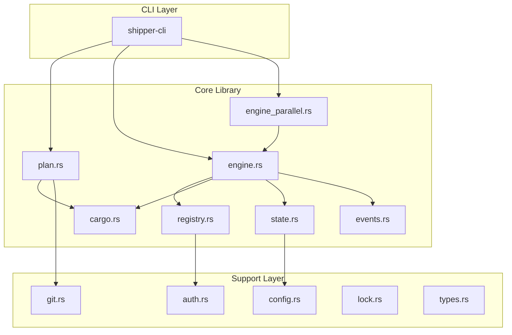
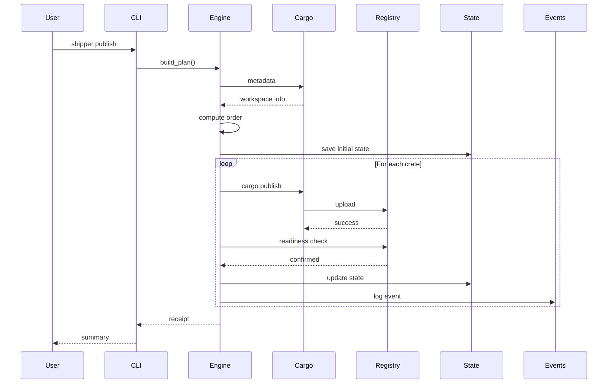
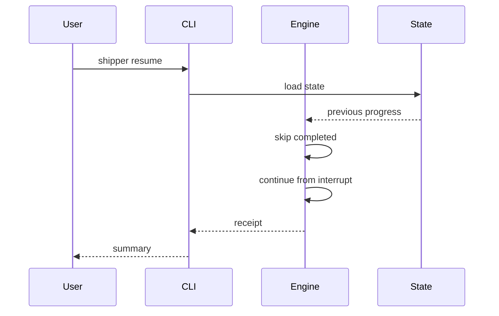
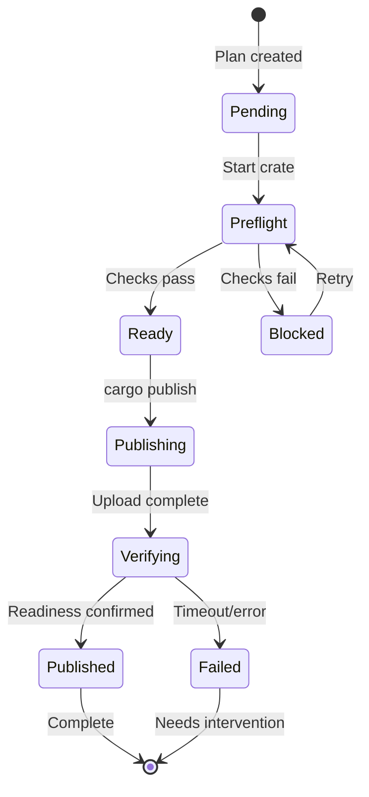
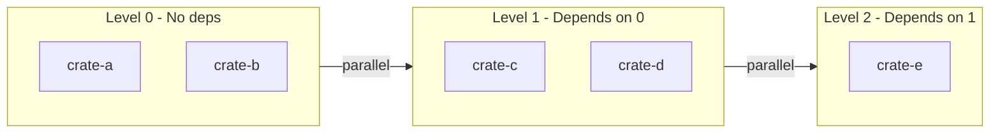

# Shipper Architecture

This document describes the architecture of Shipper, a reliability layer for `cargo publish`.

## System Overview

Shipper wraps `cargo publish` with additional safety guarantees:

- **Deterministic ordering** - Crates publish in a reproducible order
- **Preflight verification** - Issues are caught before publishing
- **Readiness verification** - Confirms crates are available after publish
- **Resumable execution** - Interrupted publishes can be resumed
- **Evidence capture** - Receipts and logs for audit trails



---

## Module Responsibilities

### Core Modules

| Module | Responsibility |
|--------|----------------|
| [`plan.rs`](../crates/shipper/src/plan.rs) | Builds deterministic publish order based on dependency graph |
| [`engine.rs`](../crates/shipper/src/engine.rs) | Orchestrates the publish workflow: plan, preflight, publish, verify |
| [`engine_parallel.rs`](../crates/shipper/src/engine_parallel.rs) | Parallel execution of independent dependency levels |
| [`registry.rs`](../crates/shipper/src/registry.rs) | Interacts with crates.io API for readiness verification |
| [`cargo.rs`](../crates/shipper/src/cargo.rs) | Wraps `cargo` commands with error handling |
| [`state.rs`](../crates/shipper/src/state.rs) | Persists execution state for resume capability |
| [`events.rs`](../crates/shipper/src/events.rs) | Append-only event log for audit trails |

### Support Modules

| Module | Responsibility |
|--------|----------------|
| [`config.rs`](../crates/shipper/src/config.rs) | Parses `.shipper.toml` configuration files |
| [`auth.rs`](../crates/shipper/src/auth.rs) | Resolves registry tokens from environment |
| [`git.rs`](../crates/shipper/src/git.rs) | Git operations (tag detection, repo root) |
| [`lock.rs`](../crates/shipper/src/lock.rs) | File-based locking to prevent concurrent runs |
| [`types.rs`](../crates/shipper/src/types.rs) | Core types: `PublishPlan`, `CrateInfo`, `PublishState`, etc. |

---

## Data Flow

### Publish Workflow



### Resume Flow



---

## State Machine

Each crate transitions through these states during publishing:



---

## Key Types

### PublishPlan

```rust
pub struct PublishPlan {
    pub crates: Vec<CrateInfo>,
    pub order: Vec<String>,  // Deterministic publish order
    pub graph: DependencyGraph,
}
```

### CrateInfo

```rust
pub struct CrateInfo {
    pub name: String,
    pub version: String,
    pub path: PathBuf,
    pub dependencies: Vec<String>,
}
```

### PublishState

```rust
pub struct PublishState {
    pub plan: PublishPlan,
    pub progress: HashMap<String, CrateProgress>,
    pub started_at: DateTime<Utc>,
    pub updated_at: DateTime<Utc>,
}
```

---

## Extension Points

### StateStore Trait

Custom state storage backends can implement:

```rust
pub trait StateStore {
    fn load(&self, path: &Path) -> Result<PublishState>;
    fn save(&self, state: &PublishState, path: &Path) -> Result<()>;
}
```

Default: JSON file in `.shipper/state.json`

### RegistryClient Trait

Alternative registries can be supported:

```rust
pub trait RegistryClient {
    fn check_readiness(&self, crate_name: &str, version: &str) -> Result<Readiness>;
}
```

Default: crates.io API client

---

## Error Handling

Shipper uses structured error types via `thiserror`:

```rust
#[derive(Debug, thiserror::Error)]
pub enum Error {
    #[error("Cargo command failed: {0}")]
    CargoFailed(String),
    
    #[error("Registry error: {0}")]
    RegistryError(String),
    
    #[error("State error: {0}")]
    StateError(String),
    
    // ... additional variants
}
```

Errors are categorized as:
- **Recoverable**: Network timeouts, rate limits (retry automatically)
- **Actionable**: Missing tokens, config errors (user action needed)
- **Fatal**: Corrupt state, lock conflicts (intervention required)

---

## Concurrency Model

### Parallel Publishing

When enabled via `--parallel`, Shipper:

1. Analyzes the dependency graph
2. Groups crates into dependency levels
3. Publishes each level in parallel
4. Waits for all crates in a level before proceeding



### Locking

File-based locking prevents concurrent Shipper runs:

- Lock file: `.shipper/lock`
- Acquired on start, released on completion
- `--force` can break stale locks

---

## Configuration

See [configuration.md](configuration.md) for full details.

Configuration sources (in priority order):

1. CLI arguments
2. Environment variables
3. `.shipper.toml` file
4. Defaults

---

## Security Considerations

### Token Handling

- Tokens are read from environment variables or `cargo login` config
- Tokens are never logged or persisted in state files
- Token resolution is lazy (only when needed)

### State Files

- State files contain no secrets
- Receipts contain only public crate information
- Event logs capture actions, not credentials

---

## Testing Strategy

| Test Type | Location | Purpose |
|-----------|----------|---------|
| Unit tests | `#[cfg(test)]` modules | Test individual functions |
| Integration tests | `tests/` directories | Test module interactions |
| E2E tests | `cli_e2e.rs` | Test CLI with mocked registry |
| Property tests | `proptest` throughout | Test invariants |
| Fuzz tests | `fuzz/` | Test deserialization robustness |

---

## Future Considerations

See [ROADMAP.md](../ROADMAP.md) for planned changes that may affect architecture.

Potential architectural changes:
- Cloud storage backends for state
- Plugin system for verification steps
- Multi-registry support